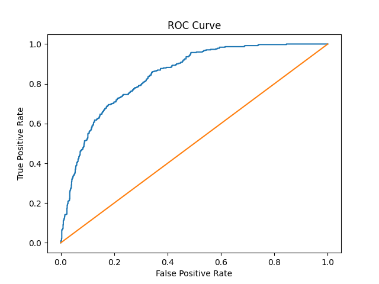
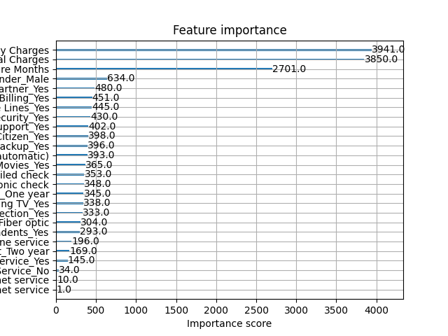
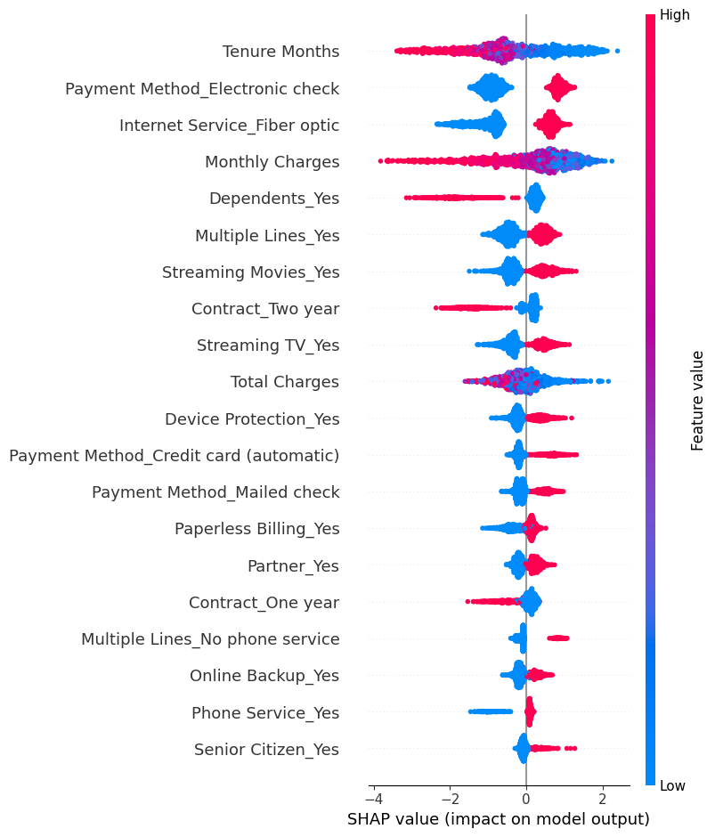

# Customer Churn Prediction

## Project Overview

This project predicts whether a telecom customer is likely to churn (leave the service) using machine learning.

Customer churn prediction helps businesses identify customers who are likely to cancel their service so they can take preventive actions such as offers, improved support, or retention strategies.

This project includes:

- Data cleaning and preprocessing
- Exploratory Data Analysis (EDA)
- Feature engineering
- Machine learning model training
- Model evaluation
- Feature importance analysis
- SHAP explainability
- Model pipeline and deployment-ready structure

---

## Dataset

Dataset used: **Telco Customer Churn Dataset**

The dataset contains customer information such as:

- Demographics
- Account information
- Internet services
- Billing details
- Contract information

Target Variable:

Churn  
- 1 → Customer churned  
- 0 → Customer stayed

---

## Project Structure

```
Customer-Churn-Prediction
│
├── data
│   └── Telco_churn.xlsx
│
├── models
│   └── churn_model.pkl
│
├── notebooks
│   └── 01_eda_and_cleaning.ipynb
│
├── src
│   ├── feature_importance.png
│   ├── roc_curve.png
│   └── shap_summary_output.png
│
├── app.py
├── requirements.txt
└── README.md
```

---

## Machine Learning Pipeline

The project uses a **Scikit-Learn Pipeline** to ensure consistent preprocessing and prediction steps.

Pipeline includes:

1. Data preprocessing
2. Feature scaling
3. Model training
4. Prediction

This approach ensures that the same transformations used during training are also applied during inference.

---

## Model Performance

Accuracy: **0.7733**

Precision: **0.5714**

Recall: **0.5882**

F1 Score: **0.5797**

ROC-AUC: **0.8122**

---

## Confusion Matrix

```
[[868 165]
 [154 220]]
```

Where:

- True Negatives: 868
- False Positives: 165
- False Negatives: 154
- True Positives: 220

---

## ROC Curve



---

## Feature Importance



---

## SHAP Feature Explanation



---

## Installation

Clone the repository:

```
git clone https://github.com/your-username/customer-churn-prediction.git
```

Move into the project directory:

```
cd customer-churn-prediction
```

Install dependencies:

```
pip install -r requirements.txt
```

---

## Running the Project

Run the application:

```
python app.py
```

Load the trained model:

```python
import joblib

model = joblib.load("models/churn_model.pkl")
prediction = model.predict(new_data)
```

---

## Technologies Used

- Python
- Pandas
- NumPy
- Scikit-Learn
- Matplotlib
- SHAP
- Joblib

---

## Future Improvements

- Deploy the model using FastAPI or Flask
- Build a web interface for predictions
- Add hyperparameter tuning
- Improve model recall for churn detection

---

## Author

Abhihail Jacob  
AI Engineering Journey 🚀